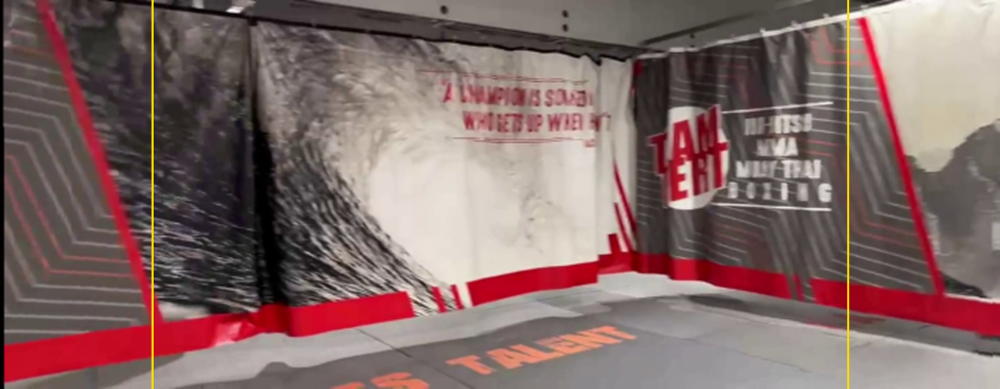
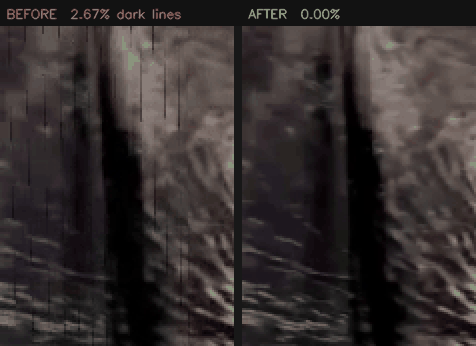
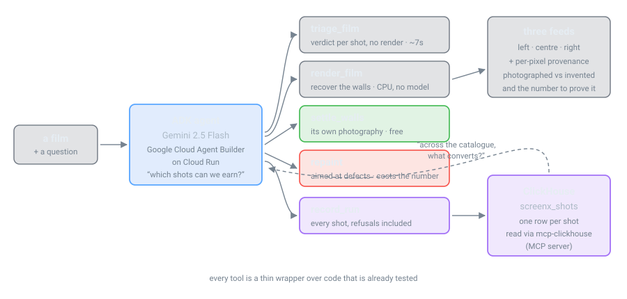

<div align="center">


### Which shots can we earn?

**An agent that triages a film for 270° immersive conversion, recovers the side
walls from the footage itself, and never lies about what it invented.**

[](https://frameflow-460687416455.us-central1.run.app)
[](https://cloud.google.com/vertex-ai)
[](https://cloud.google.com/products/agent-builder)
[](https://github.com/ClickHouse/mcp-clickhouse)
[](LICENSE)
[](#tests)

Built for [Agentic Cinema: The Blockbuster Hackathon](https://agentic-cinema.devpost.com/) — ClickHouse track.



<sub>The yellow lines mark where the main screen ends. **Everything outside them was
recovered from this camera's own pan** — 90.4% genuinely photographed, nothing invented.</sub>

</div>

---

## The problem

The ScreenX format puts a film on three walls instead of one. Converting a film
to it takes **about two months per title** — two to three weeks moving assets,
four or more weeks of CG, two weeks of QC. Even then only part of a film gets
converted: *Bohemian Rhapsody* got 43 minutes of 134.

The labour is artists pulling frames from alternate takes and B-roll and
rotoscoping them into the side panels. Wikipedia is blunt about the consequence
— the format *"has been rarely produced for Hollywood studio films due to the
complexity of the additional CGI work."*

But much of that work goes on a question that is not an art problem at all:
**which shots are even possible.** A panning camera already photographed the
side walls; the crop threw them away. A locked-off close-up never filmed them,
and no artist time recovers what was never photographed.

That question is geometry. It is cheap. And answering it first is the
difference between converting 43 minutes and converting the film.

## Ask it

```
> Is locked_off.mp4 worth converting?

  → triage_film(video="locked_off.mp4")

  No. The camera is locked off, so nothing was filmed beyond the central
  frame and no side walls can be recovered from its own footage.
  Not worth spending artist time on.
```

```
> Triage pan_flat.mp4 and locked_off.mp4. Which is worth an artist week?

  pan_flat.mp4    100% of its running time can be widened to FULL,
                  61.6% effective coverage.        Worth an artist week.
  locked_off.mp4  0%. LOCKED OFF.                  Not worth an artist week.
```

Both transcripts are from the deployed service. Triage runs the *same* motion
classifier, geometry hold-out probe and gate a real render uses — on a window of
each shot. On a 27-second handheld pan it took **91 seconds** and predicted
50.7% effective coverage; the full render took **two hours** and delivered
**52.54%**.

It understates by construction. A window holds fewer donor frames than the whole
shot, so a render recovers more, never less. Understating costs you a shot you
could have had. Overstating costs you the artist-month you committed on the
strength of it.

## What comes out

<div align="center">

</div>

Those black lines were a **bug**, not a limitation. The donor frame was warped
with bilinear interpolation against a black border while its validity mask was
warped nearest-neighbour — so every donor's edge column composited at roughly
half brightness *and was labelled real photography*. Reproduced in isolation: a
flat 180-grey source yields a mask-valid column at 90.

| on the same footage | before | after |
|---|---|---|
| thin dark lines | 2.67% of wall columns | **0.00%** |
| wall shimmer vs the picture | 1.22× | **1.00×** |
| delivered frame rate | 24 (source was 30) | **30** |
| repaint cost on a good wall | the whole wing | **1.2%** |

Three real rooms, three different days, CPU only, no model involved:

| clip | genuinely photographed wall |
|---|---|
| café | 98.7% |
| apartment walk | up to 99.3% |
| gym pan, 1024px, whole take | **90.4%** |

## The line Frameflow refuses to blur

Every pixel in a side wall is either **photographed** or **invented**:

| rung | what it means |
|---|---|
| `primary` | the frame itself |
| `recovered` | this camera filmed it, earlier in the same shot |
| `donated` · `retrieved` | filmed at this location, in another take or cut |
| `directed` | a model drew it, steered by someone who knows the room |
| `generated` | a model drew it |

`mean_real_wing` is the fraction that is genuinely photography. When a model
repaints something that number falls by exactly the repainted share, and the
per-pixel provenance map on disk is rewritten to match.

**A refusal is a real answer.** `OFF` and `LOCKED` shots mean the camera never
filmed anything out there, and Frameflow says so rather than inventing something
and calling it a conversion.

## Why ClickHouse is load-bearing

The studio question is not *"how did this shot do"* — it is *"across everything
we own, what converts without inventing anything?"* That is a query, and
**refused shots have to be rows** or it cannot be asked.

```sql
SELECT source,
       count()                                          AS shots,
       countIf(state IN ('FULL','NARROW','BORROWED'))   AS earned,
       round(avg(photographic), 4)                      AS mean_real_wing
FROM frameflow_shots
GROUP BY source
ORDER BY earned DESC
```

One row per shot: motion class, backend, geometry dB, gate verdict, coverage,
every provenance rung, and three artefact measurements. Reads go through the
official [`mcp-clickhouse`](https://github.com/ClickHouse/mcp-clickhouse) MCP
server, so the agent composes its own questions rather than picking from ones
somebody guessed in advance.

## Three agents, because the work splits along a real seam

**scout** decides what is worth doing and *cannot render*. **conversion** does
the work and does not judge whether it was worth doing. **archivist** keeps the
record and touches no pixels.

That separation is not decoration. A single agent holding all three sets of
tools drifts: asked *"is this worth converting?"* it renders to find out — which
is exactly the cost triage exists to avoid. Taking `render_film` away from the
scout is what keeps triage honest, and there is a test that asserts it.

## How it fits together

<div align="center">

</div>

## Run it

```bash
pip install -r requirements.txt
python tools/make_test_clip.py                  # synthetic clips, known truth

python -m frameflow.triage media/pan_flat.mp4   # earned
python -m frameflow.triage media/locked_off.mp4 # refused — and cheap to learn

python -m frameflow.render media/pan_flat.mp4 -o jobs/demo --deliver
python -m frameflow.polish jobs/demo            # settle the walls; free
python app.py                                   # Frameflow Studio, on :8420
```

<details>
<summary><b>The agent</b> — needs Google Cloud</summary>

```bash
gcloud auth application-default login
export GOOGLE_GENAI_USE_VERTEXAI=TRUE
export GOOGLE_CLOUD_PROJECT=your-project GOOGLE_CLOUD_LOCATION=us-central1
python server.py     # agent on :8080/dev-ui/ , studio on :8080/studio/
```
</details>

<details>
<summary><b>The ledger</b> — needs a free ClickHouse Cloud service</summary>

```bash
export CLICKHOUSE_HOST=... CLICKHOUSE_USER=... CLICKHOUSE_PASSWORD=...
python -m frameflow.ledger --write jobs/demo
python -m frameflow.ledger --examples
```

Without it everything else still runs, and the agent says the ledger is not
connected rather than answering catalogue questions from a single job.
</details>

<details>
<summary><b>The 3D path</b> — needs CUDA</summary>

```bash
pip install -r requirements.txt -r requirements-gpu.txt
python tools/verify_gpu.py   # checks the CUDA path against known 3D truth
```
</details>

## Tests

```bash
python -m pytest tests -q          # 651 checks across 11 suites
python tests/test_e2e.py           # the joins, which is where bugs live
python tests/test_polish.py        # the finishing pass, with readable output
```

Each suite records results in a `FAIL` list and also runs standalone. `pytest`
never inspected that list, so a test that recorded five failed checks and
returned normally was reported as **passing** — which is exactly what happened
when the agent became a multi-agent network. `tests/conftest.py` now fails any
test whose module recorded a failure while it ran, and turning it on
immediately surfaced two more assertions that had been quietly wrong.

`test_e2e.py` writes its fixture at **30fps deliberately**, because a 24fps
fixture agreed with three different hardcoded defaults and let a film that came
out a quarter slow pass the whole suite.

## Layout

```
frameflow/          the pipeline
  triage.py           verdicts without rendering
  render.py           the conversion pipeline
  wingcoverage.py     propagation, settling, coverage metrics
  gating.py           the hold-out geometry probe and the gate
  polish.py           inspect, settle, and aimed repaint
  backends.py         mosaic · layered · gaussian
  walls.py            auditorium geometry
  ledger.py           the ClickHouse schema and writer
agent_service/      the ADK agent and its tools
tests/              651 checks across 11 suites
tools/              synthetic footage, ground-truth validation, GPU checks
app.py              Frameflow Studio
server.py           agent + studio on one port
```

Inside `frameflow` the modules are peers rather than a hierarchy: each runs on
its own, and each is a standalone finding in the
[research log](docs/RESEARCH-LOG.md).

## Licence

Apache-2.0 — see [LICENSE](LICENSE) and [NOTICE](NOTICE).
